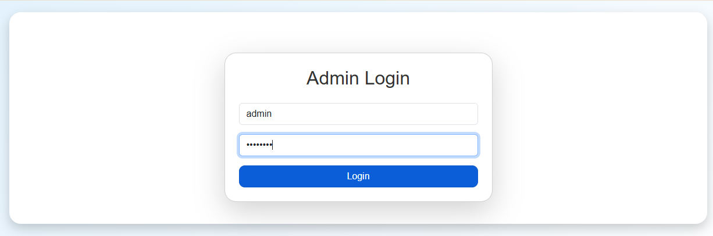
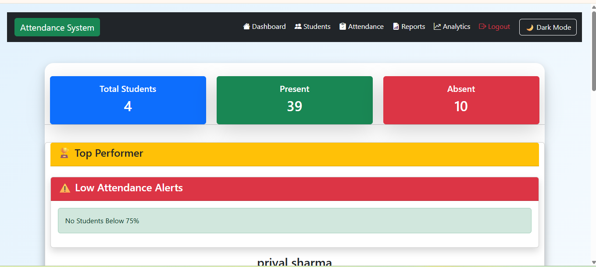
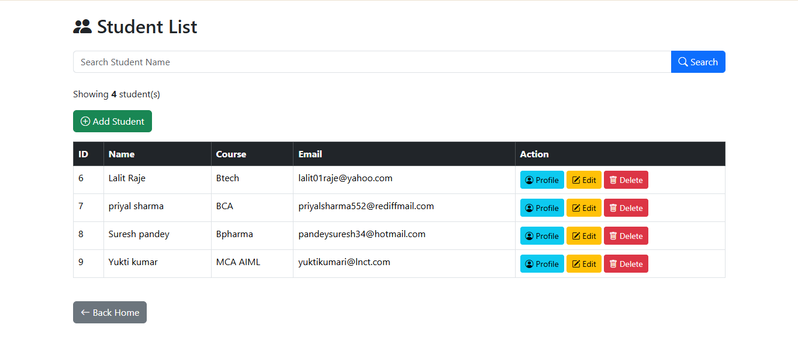
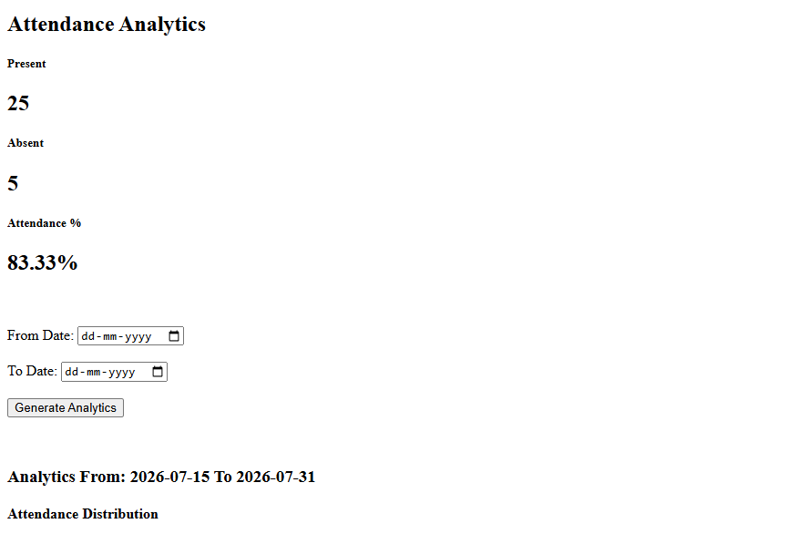
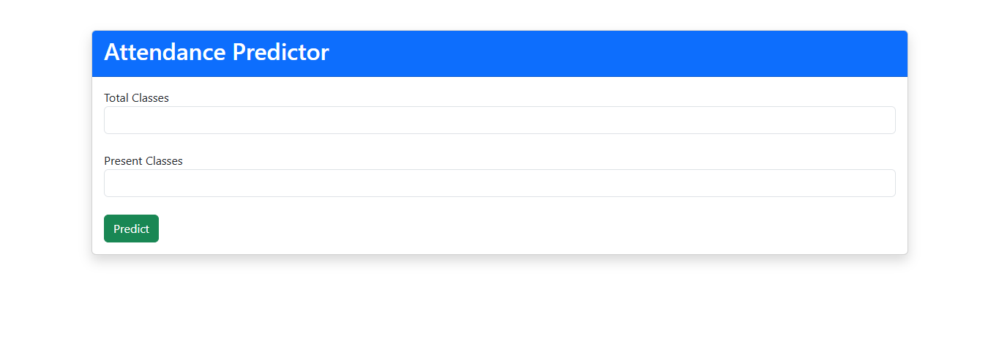
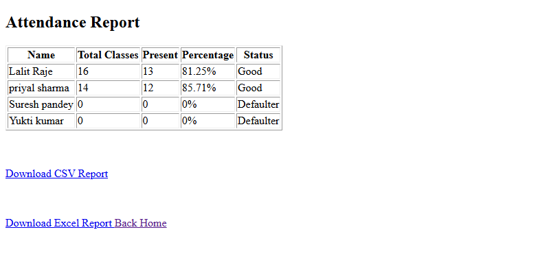
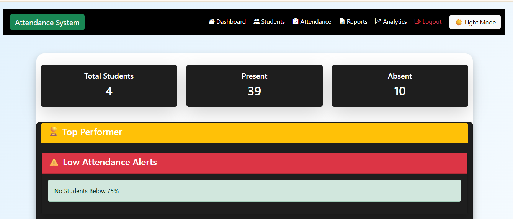
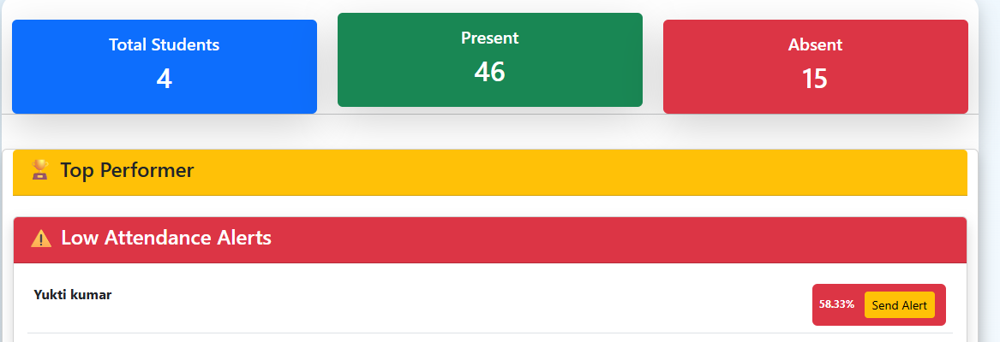

# 🎓 Smart Campus Attendance & Analytics System

A modern Attendance Management System built using **Python, Flask, SQLite, Bootstrap, Pandas, and Chart.js**. The project provides secure role-based authentication, attendance tracking, analytics dashboards, automated email alerts, and report generation.

---

## 🚀 Features

### 🔐 Authentication
- Secure Login System
- Password Hashing
- Role-Based Access Control
- Admin Login
- Teacher Login
- Student Login

### 👨‍🎓 Student Management
- Add Student
- Edit Student
- Delete Student
- Student Search
- Student Profile
- Student Email Management

### 📅 Attendance Management
- Mark Attendance
- Attendance History
- Attendance Predictor
- Low Attendance Alerts
- Top Performer Detection

### 📊 Analytics Dashboard
- Present vs Absent Charts
- Attendance Percentage
- Recent Activity
- Student Performance Analytics

### 📧 Email Automation
- Gmail SMTP Integration
- Attendance Warning Emails
- Low Attendance Notifications

### 📄 Reports
- PDF Report
- Excel Report
- CSV Export

### 🎨 User Interface
- Responsive Bootstrap UI
- Dark Mode
- Dashboard Cards
- Icons
- Professional Layout

---

## 🛠️ Technologies Used

- Python
- Flask
- SQLite
- Bootstrap 5
- HTML5
- CSS3
- JavaScript
- Pandas
- Chart.js
- ReportLab
- Gmail SMTP
- Git & GitHub

---

## 📁 Project Structure

```
Attendance_System/
│
├── app.py
├── database.db
├── requirements.txt
├── README.md
├── Procfile
│
├── static/
│   ├── style.css
│   ├── script.js
│
├── templates/
│
├── reports/
│
└── screenshots/
```

---

## 🔑 Default Login Credentials

### 👨‍💼 Admin

Username:
```
admin
```

Password:
```
admin123
```

---

### 👨‍🏫 Teacher

Username:
```
teacher
```

Password:
```
teacher123
```

---

### 🎓 Student

Username:
```
student
```

Password:
```
student123
```

---

## 📸 Screenshots

### 🔐 Login Page



---

### 🏠 Dashboard



---

### 👨‍🎓 Student Management



---

### 📊 Analytics Dashboard



---

### 📈 Attendance Predictor



---

### 📄 Reports



---

### 🌙 Dark Mode



---

### 📧 Email Alerts



---

## 🚀 Installation

Clone the repository

```bash
git clone https://github.com/YOUR_GITHUB_USERNAME/Smart-Campus-Attendance-System.git
```

Go to project folder

```bash
cd Smart-Campus-Attendance-System
```

Install dependencies

```bash
pip install -r requirements.txt
```

Run the application

```bash
python app.py
```

---

## 🔮 Future Enhancements

- Face Recognition Attendance
- QR Code Attendance
- Student Photo Upload
- Leave Management
- SMS Notifications
- AI Attendance Prediction
- Cloud Deployment
- Mobile Responsive UI

---

## 👨‍💻 Author

**Tanmay Bhawsar**

GitHub:
https://github.com/Hightensions

LinkedIn:
https://www.linkedin.com/in/tanmay-bhawsar-1259a2238/

---

⭐ If you like this project, don't forget to star the repository!